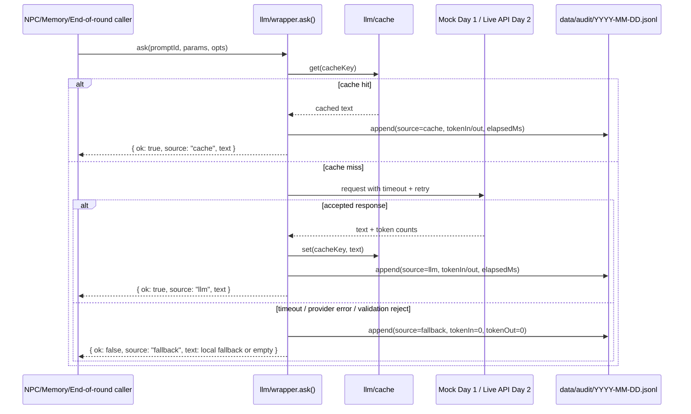

# Day 2 LLM Wrapper Note

Current status: the repo already has a working wrapper scaffold in `apps/server/src/llm/` (`wrapper.js`, `cache.js`, `audit.js`) running in mock mode. Day 2 keeps that boundary and swaps the provider behind it from `mock` to a live API; NPC, memory, and critique code still call one function only.

## Interface

```js
ask(promptId, params, {
  timeoutMs = 5000,
  useCache = true
}) -> Promise<{
  ok,
  text,
  source,     // 'llm' | 'cache' | 'fallback'
  elapsedMs,
  tokenIn,
  tokenOut,
  promptId
}>
```

- `promptId` is the stable contract between gameplay code and prompt templates, for example `npc_intent`, `npc_utter`, `summarize_session`, `update_persona_impression`.
- `params` is structured context only; business code does not call OpenAI/Anthropic directly.
- Cache key: `sha256(promptId + JSON.stringify(params))`.
- `source` is the judge-facing proof of whether the answer came from live LLM, cache, or fallback.

## Sequence



## Failure, budget, audit

- Failure policy: gameplay never talks to the provider directly, so network/provider errors stay inside the wrapper and do not crash the game loop.
- Timeout/retry: 5 s hard cut with `AbortController`, retry backoff `0/200/500/1200 ms`.
- Validation gate: reject empty text, text shorter than 6 chars, text longer than 200 chars, or any text containing forbidden words from `demo/critiques/pool.json`. Validation rejection goes straight to fallback; it does not retry the LLM.
- Token budget for Day 2: input `< 2000`, output `< 200`. The wrapper result already carries `tokenIn` and `tokenOut`; the live provider fills these so we can prove prompt size stays flat as memory grows.
- Cache: SQLite first (`data/llm-cache.sqlite3` via `better-sqlite3`), JSON file fallback if SQLite is unavailable. Same caller contract either way.
- Audit log: one JSONL line per call at `data/audit/YYYY-MM-DD.jsonl`.

Example line:

```json
{"ts":1760000000000,"promptId":"npc_utter","params":{"npcId":"mochi","sessionId":"s1"},"text":"See you in the blue corner.","source":"llm","elapsedMs":412,"tokenIn":823,"tokenOut":24}
```

## Q1-Q5 mapping

| Judge question | Wrapper contribution |
|---|---|
| Q1: Does the NPC really remember the player? | Makes `summarize_session` and `update_persona_impression` reliable and auditable; memory truth lives upstream, but wrapper gives a stable call path. |
| Q2: How do you stop memory bloat? | Enforces/logs token budget and exposes `tokenIn/tokenOut` in audit lines so we can show prompt size stays bounded. |
| Q3: Will personality drift? | Keeps one prompt entry point, one validation gate, and one audit trail; anchors stay inspectable instead of being scattered across game logic. |
| Q4: What happens offline? | Timeout + retry + fallback means the game keeps moving even if the provider is down or the network is cut. |
| Q5: Where is the long-term bond? | Cache/fallback keep response latency low enough for repeated cross-session interactions; the wrapper is the reliability layer under the bond system, not the bond logic itself. |

## Q1-Q5 评委问题中本模块负责的是哪几个

直接负责的是 Q2（Token 预算与膨胀控制）和 Q4（离线/超时降级不崩）。Q1、Q3、Q5 的业务语义在记忆、人设和关系系统里，但它们都依赖本模块提供稳定、可审计、可回退的 LLM 调用通路。
