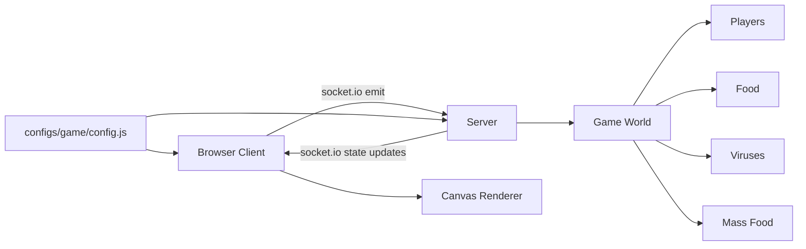
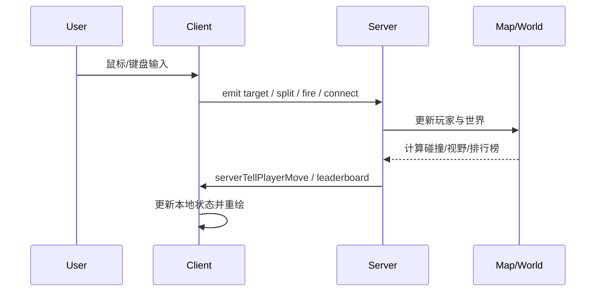

# Agar.io Clone Overview

这份文档先回答一个最重要的问题：这个项目由哪些部分组成。

## 项目目标

这是一个基于 `Node.js + Express + Socket.IO + HTML5 Canvas` 的多人实时吞噬游戏。

它把职责分成两大块：

- 服务端：维护真实游戏世界
- 客户端：负责输入、接收状态、渲染画面

核心原则很明确：

- 游戏逻辑主要在服务端
- 客户端不是权威状态源
- 客户端更像一个“远程渲染器 + 输入采集器”

## 目录地图

```text
apps/
  client/
    index.html          页面骨架
    src/
      app.js            客户端主入口
      canvas.js         输入采集
      render.js         画布绘制
      chat-client.js    聊天与命令
  server/
    src/
      server.js         服务端主入口
      game-logic.js     基础边界逻辑
      map/              地图与实体管理
      lib/              工具函数
      repositories/     日志/聊天存储

configs/game/
  config.js             全局游戏参数

dist/
  client/               构建产物
  server/               构建产物

tests/
  unit/                 单元测试
```

## 运行时架构



## 模块分工

## 1. 客户端

关键文件：

- `apps/client/src/app.js`
- `apps/client/src/canvas.js`
- `apps/client/src/render.js`

职责：

- 进入游戏
- 建立 socket 连接
- 监听服务端事件
- 保存当前可见世界状态
- 每帧重绘画面
- 发送玩家目标位置、分裂、喷射、连接等操作

## 2. 服务端

关键文件：

- `apps/server/src/server.js`
- `apps/server/src/map/map.js`
- `apps/server/src/map/player.js`

职责：

- 接受玩家连接
- 创建玩家并生成出生点
- 每 tick 推进世界状态
- 处理吃食物、吃玩家、碰病毒、喷质量、分裂
- 计算排行榜
- 把每个玩家可见的世界子集推送回去

## 3. 游戏世界

关键文件：

- `apps/server/src/map/map.js`
- `apps/server/src/map/food.js`
- `apps/server/src/map/virus.js`
- `apps/server/src/map/massFood.js`
- `apps/server/src/map/player.js`

职责：

- 保存实体集合
- 维持总质量平衡
- 提供玩家视野过滤
- 承载玩家、食物、病毒、喷出的质量块

## 4. 配置层

关键文件：

- `configs/game/config.js`

职责：

- 端口
- 地图大小
- 默认质量
- 最大食物数量
- 最大病毒数量
- 分裂上限
- 心跳超时
- 网络更新频率

项目里很多“玩法手感”都先从这里调。

## 5. 构建与测试

关键文件：

- `gulpfile.js`
- `webpack.config.js`
- `tests/unit/*`

职责：

- 构建 client/server 到 `dist/`
- 打包前端 JS
- 运行 lint
- 跑单元测试

## 数据流总览



## 我对这个仓库的第一印象

- 主体仍然是传统的 Agar.io 架构：服务端权威，客户端渲染。
- 这个分支在经典玩法上叠加了不少自定义系统：
  - `materialization`
  - `connection`
  - `relationship`
  - `body`
  - `player card`
- 这意味着它已经不只是“纯净版吞噬游戏”，而是在往自己的玩法分支演化。

## 推荐阅读顺序

如果要快速吃透，建议按这个顺序读：

1. `configs/game/config.js`
2. `apps/server/src/server.js`
3. `apps/server/src/map/map.js`
4. `apps/server/src/map/player.js`
5. `apps/client/src/app.js`
6. `apps/client/src/render.js`
7. `docs/06-input-to-movement.md`
8. `docs/07-devour-and-collision.md`
9. `docs/08-world-entities-and-visibility.md`
10. `docs/09-socket-and-sync-protocol.md`
11. `docs/10-custom-systems.md`
12. `docs/11-runtime-and-debug-notes.md`

## 文档地图

目前 `docs/` 里的学习文档可以这样理解：

- `00-overview.md`：总地图
- `01-startup-flow.md`：启动到入场
- `02-client-render-loop.md`：客户端如何接收并绘制
- `03-server-game-loop.md`：服务端三条循环
- `04-player-and-cell-model.md`：核心数据模型
- `05-your-notes.md`：长期笔记与问题池
- `06-input-to-movement.md`：输入到移动
- `07-devour-and-collision.md`：吞噬与碰撞
- `08-world-entities-and-visibility.md`：世界实体与视野
- `09-socket-and-sync-protocol.md`：socket 协议
- `10-custom-systems.md`：扩展玩法系统
- `11-runtime-and-debug-notes.md`：运行与排障视角
