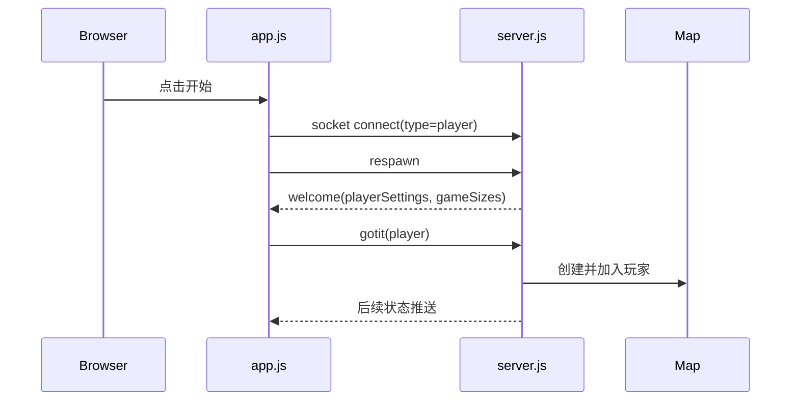

# Startup Flow

这份文档关注“从启动项目到真正进入游戏”的链路。

## 一句话概括

启动流程分两段：

1. 本地构建并启动服务端
2. 浏览器加载页面后，通过 `socket.io` 完成欢迎握手并创建玩家

## 1. 启动命令

仓库原始 README 推荐：

```bash
npm install
npm start
```

但这个仓库的 `package.json` 脚本偏 Windows，真正可移植的核心流程在 `gulpfile.js`：

- `build`
- `run`
- `watch`

本次实际跑通的是：

```bash
node ./node_modules/gulp/bin/gulp.js build
node dist/server/server.js
```

## 2. 构建阶段

`gulpfile.js` 里，`build` 做了这些事：

- `lint`
- 复制客户端 `index.html`
- 复制客户端静态资源
- 用 webpack 打包客户端 JS
- 编译服务端代码到 `dist/server`
- 跑 mocha 单元测试

构建结果：

- 客户端进入 `dist/client`
- 服务端进入 `dist/server`

## 3. 服务端启动

入口文件：

- `apps/server/src/server.js`

服务端启动时会做这些事：

- 创建 `express` 应用
- 创建 `http` server
- 把 `socket.io` 挂到 HTTP server 上
- 创建 `map = new Map(config)`
- 初始化全局状态：
  - `sockets`
  - `spectators`
  - `leaderboard`
  - `connectionTimers`
- 暴露静态资源目录：`dist/client`
- 监听端口，默认 `3000`

关键配置来自：

- `configs/game/config.js`

其中最重要的是：

- `host: "0.0.0.0"`
- `port: 3000`
- `gameWidth: 5000`
- `gameHeight: 5000`

## 4. 浏览器加载页面

浏览器访问 `http://127.0.0.1:3000` 后：

- 服务端用 `express.static(...)` 返回页面
- 页面入口是 `dist/client/index.html`
- 前端脚本加载 `dist/client/js/app.js`

界面初始上会看到：

- 开始游戏
- 观战
- 绘制名片
- 设置

## 5. 客户端初始化

入口文件：

- `apps/client/src/app.js`

页面加载后主要做几件事：

- 加载语言配置
- 初始化玩家名片编辑器
- 绑定开始按钮、观战按钮、设置按钮
- 创建全局 `Canvas` 和 `ChatClient`
- 但此时还没有真正连上服务器

真正的连接发生在 `enterGame(type)`。

## 6. 点击开始后的流程

调用链大致如下：

```text
点击开始
-> startGame('player')
-> enterGame('player')
-> socket = io({ query: "type=player" })
-> setupSocket(socket)
-> socket.emit('respawn')
```

这里有两个关键点：

- `type=player` 决定服务端如何处理这个连接
- 客户端不是连接上就立刻成为玩家，而是还要经过后续握手

## 7. 服务端接收连接

在 `apps/server/src/server.js` 里：

```text
io.on('connection', socket => {
  let type = socket.handshake.query.type;
  switch (type) {
    case 'player': addPlayer(socket)
    case 'spectator': addSpectator(socket)
  }
})
```

如果是普通玩家：

- 走 `addPlayer(socket)`

如果是观战者：

- 走 `addSpectator(socket)`

## 8. `respawn -> welcome -> gotit` 握手

这是进入游戏最关键的一小段。

### 服务端 `respawn`

客户端先发：

- `socket.emit('respawn')`

服务端收到后会：

- 把当前 `currentPlayer` 从玩家列表移除
- 发送 `welcome`

`welcome` 里带两类数据：

- 玩家基础对象
- 地图宽高

### 客户端 `welcome`

客户端在 `setupSocket(socket)` 里监听：

- `socket.on('welcome', ...)`

拿到数据后会：

- 把服务端给的玩家对象写入本地 `player`
- 回填名字、屏幕尺寸、目标位置
- 带上 `playerCardPreviewDataUrl`
- 标记 `global.gameStart = true`
- 保存地图尺寸
- 调用 `resize()`
- 最关键：再发出 `socket.emit('gotit', player)`

### 服务端 `gotit`

服务端监听：

- `socket.on('gotit', clientPlayerData => ...)`

这里才正式完成“玩家入场”：

- 为玩家生成出生点
- 初始化初始质量
- 校验昵称是否合法
- 防止重复连接
- 把玩家加入 `map.players`
- 广播 `playerJoin`

## 9. 出生点生成

服务端调用：

- `generateSpawnpoint()`

它会：

- 根据默认质量算出半径
- 再调用 `getPosition(...)`

出生点策略由配置决定：

- `newPlayerInitialPosition: "farthest"`

也就是偏向把新玩家生成在更远的位置，减少开局冲突。

## 10. 进入主循环

一旦客户端完成 `welcome/gotit` 握手，后面就进入稳定循环：

- 客户端每帧发目标位置心跳 `socket.emit('0', target)`
- 服务端循环推进世界
- 服务端定期推送 `serverTellPlayerMove`
- 客户端不断重绘

## 11. 启动链路图



## 12. 当前实现里的注意点

- `respawn` 的命名有点误导，它同时承担了“首次入场”和“再次重生”。
- `welcome` 只是发基础信息，不代表玩家已经正式进图。
- 真正把玩家放进世界的是服务端的 `gotit` 回调。
- 客户端在 `gameLoop()` 中持续发送 target 心跳，所以“渲染循环”和“输入同步”是耦合在一起的。
