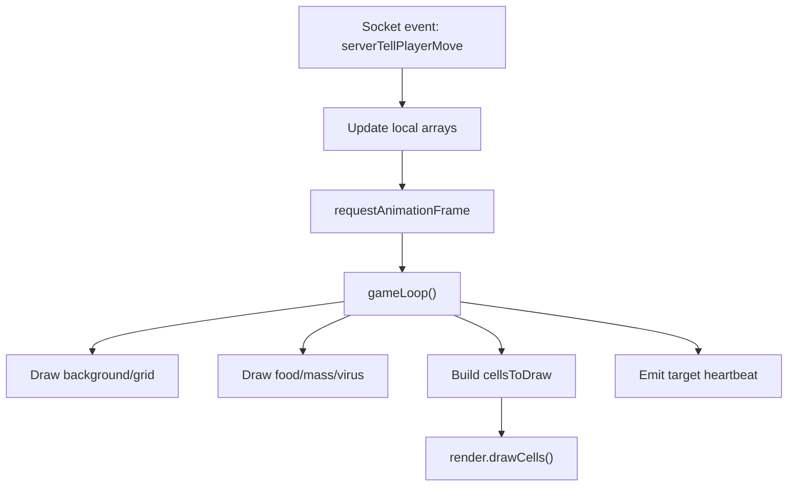

# Client Render Loop

这份文档关注客户端怎么接收状态并画出来。

## 一句话概括

客户端自己不计算真实世界，它做三件事：

1. 采集输入
2. 接收服务端推送的世界快照
3. 用 Canvas 每帧绘制当前快照

## 关键文件

- `apps/client/src/app.js`
- `apps/client/src/canvas.js`
- `apps/client/src/render.js`

## 客户端状态

`app.js` 里维护了一批全局状态：

- `player`
- `users`
- `foods`
- `viruses`
- `fireFood`
- `leaderboard`
- `target`

这些值的来源可以分成两类：

- 本地输入产生：`target`
- 服务端同步产生：玩家、食物、病毒、质量块、排行榜

## 输入是怎么采集的

输入在 `apps/client/src/canvas.js`。

### 鼠标/触摸

会更新：

- `target.x`
- `target.y`

这个 `target` 表示“我想往屏幕哪个方向移动”。

### 键盘

特殊按键会触发 socket 事件：

- `0`：发送目标位置心跳
- `1`：喷射质量
- `2`：分裂
- `3`：连接动作

这意味着客户端并不直接改变世界，只是发意图给服务端。

## 服务端状态是怎么进客户端的

在 `setupSocket(socket)` 里有几个关键监听。

### 1. `welcome`

作用：

- 初始化本地玩家对象
- 保存地图尺寸
- 标记游戏开始

### 2. `leaderboard`

作用：

- 更新排行榜
- 调用 `renderStatusPanel()`

### 3. `serverTellPlayerMove`

这是最重要的同步事件。

服务端会推送：

- `playerData`
- `userData`
- `foodsList`
- `massList`
- `virusList`

客户端收到后会：

- 更新自己的位置、质量、细胞列表
- 更新其他玩家数组 `users`
- 更新食物、病毒、喷出的质量
- 更新目标名片预览
- 重新渲染 HUD

这一层本质上是“可见世界快照同步”。

## 渲染循环从哪里开始

在 `enterGame(type)` 里：

- 如果还没有动画循环句柄，就调用 `animloop()`

而 `animloop()` 实际上是：

```text
requestAnimationFrame(animloop)
-> gameLoop()
```

也就是说浏览器每一帧都会执行一次 `gameLoop()`。

## `gameLoop()` 做了什么

当 `global.gameStart === true` 时，按顺序做这些事：

1. 清空画布背景
2. 画网格
3. 画食物
4. 画喷出的质量块
5. 画病毒
6. 计算屏幕上的边界框
7. 可选画地图边框
8. 收集所有可见玩家细胞
9. 按质量排序
10. 调用 `render.drawCells(...)`
11. 再发一次目标位置心跳 `socket.emit('0', window.canvas.target)`

注意最后一步很重要：

- 客户端把“渲染循环”顺便当成了“持续心跳上报循环”

## 世界坐标转屏幕坐标

客户端拿到的实体位置是世界坐标，不是屏幕坐标。

`getPosition(entity, player, screen)` 会把它变成：

```text
entity.x - player.x + screen.width / 2
entity.y - player.y + screen.height / 2
```

也就是：

- 以自己为相机中心
- 把世界平移到当前屏幕中心

所以玩家看到的不是整个世界，而是“以自己为中心”的局部视野。

## 绘制职责怎么拆分

`app.js` 负责决定“画什么”。

`render.js` 负责决定“怎么画”。

### `render.js` 提供的关键能力

- `drawFood`
- `drawVirus`
- `drawFireFood`
- `drawCells`
- `drawGrid`
- `drawBorder`
- `drawErrorMessage`

### `drawCells` 会处理什么

对于每个细胞，它会：

- 选择普通圆形绘制还是名片头像绘制
- 画边框
- 画名字
- 可选画质量数字

而且会处理“贴着地图边缘”的特殊情况：

- 如果细胞碰到边界，就不用完整圆，而是用折线近似裁边

## 客户端的 HUD 不是画在 Canvas 上的吗

这个项目有两种前端输出：

- Canvas：游戏世界本身
- DOM：排行榜、聊天框、状态面板、名片 HUD

例如：

- `renderStatusPanel()` 更新排行榜 HTML
- 聊天框走 `ChatClient`
- 死亡/被踢时会在 Canvas 上直接画错误提示

## 客户端渲染链路图



## 这个实现的特点

- 客户端非常“瘦”，主要负责显示，不负责裁决。
- 服务端每次发的是整批可见对象，而不是细粒度事件流。
- 没有复杂的客户端预测或插值系统。
- 这让逻辑更容易读懂，但也意味着视觉平滑度和网络效率不是最激进的那种实现。

## 读代码时的抓手

如果想顺着客户端读，建议这样看：

1. `enterGame()`
2. `setupSocket()`
3. `socket.on('serverTellPlayerMove', ...)`
4. `animloop()`
5. `gameLoop()`
6. `render.drawCells()`
7. `Canvas` 类里的输入事件
