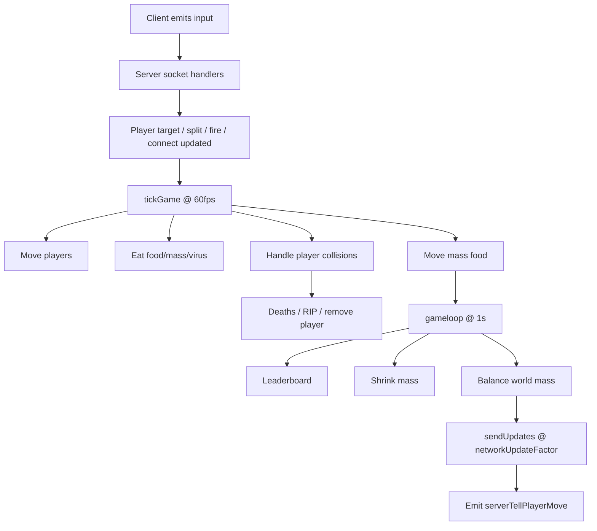

# Server Game Loop

这份文档关注服务端怎么维护玩家、食物、碰撞和广播。

## 一句话概括

服务端有三条循环，分别负责：

1. 高频推进世界状态
2. 低频做全局整理
3. 中频把可见状态广播给客户端

## 关键文件

- `apps/server/src/server.js`
- `apps/server/src/map/map.js`
- `apps/server/src/map/player.js`

## 三条主循环

在 `server.js` 最底部：

```js
setInterval(tickGame, 1000 / 60);
setInterval(gameloop, 1000);
setInterval(sendUpdates, 1000 / config.networkUpdateFactor);
```

### 1. `tickGame`，约 60 FPS

职责：

- 推进玩家运动
- 推进喷射质量块运动
- 处理玩家间吞噬碰撞

这是“实时玩法主循环”。

### 2. `gameloop`，每秒一次

职责：

- 计算排行榜
- 处理质量衰减
- 维持世界总质量平衡
- 补食物和病毒

这是“世界维护循环”。

### 3. `sendUpdates`，按网络频率发送

职责：

- 给旁观者发全图状态
- 给每个玩家发自己可见的世界子集
- 必要时附带排行榜

这是“网络广播循环”。

## `tickPlayer()`：玩家级推进

`tickGame()` 会先对每个玩家执行 `tickPlayer(currentPlayer)`。

这个函数里做了几件核心事情。

### 1. 心跳超时检测

如果 `lastHeartbeat` 太久没更新：

- 发 `kick`
- 断开 socket

这一套保障了玩家不会无限留在世界里。

### 2. 玩家移动

调用：

- `currentPlayer.move(...)`

这里会让玩家的每个 cell 朝 `target` 方向移动，并重新计算玩家中心点。

### 3. 处理吃食物

对每个 cell：

- 找出落在 cell 圆内的 food
- 删除这些 food
- 增加对应质量

### 4. 处理吃质量块

对每个 cell：

- 找出可吃的 `massFood`
- 删除这些质量块
- 增加质量

### 5. 处理吃病毒

如果 cell 吃到 virus：

- 记录要分裂的 cell 索引
- 删除 virus
- 在循环后触发 `virusSplit(...)`

## `tickGame()`：世界级推进

在玩家自身状态推进完后，`tickGame()` 还会做：

### 1. 推进喷射质量块

调用：

- `map.massFood.move(...)`

也就是被玩家喷出的质量块不是瞬间静止的，它们自己也会移动。

### 2. 玩家与玩家碰撞

调用：

- `map.players.handleCollisions(...)`

内部会：

- 遍历玩家对
- 遍历双方 cell
- 用 SAT 圆碰撞判断谁吃了谁

如果发生吞噬：

- 计算质量收益
- 给吃人的那一方加质量
- 移除被吃细胞
- 如果对方所有细胞都没了，则玩家死亡

玩家死亡时还会：

- `body.stealRandomCorePart(...)`
- 广播 `playerDied`
- 给本人发 `RIP`
- 把玩家从地图中移除

## `gameloop()`：低频世界维护

### 1. 排行榜

调用：

- `calculateLeaderboard()`

它通过 `map.players.getTopPlayers()` 获取前 10 名，并比较是否发生变化。

如果变化了：

- `leaderboardChanged = true`

### 2. 质量衰减

调用：

- `map.players.shrinkCells(...)`

也就是玩家不能只靠滚雪球无限膨胀，系统会慢慢消耗一部分质量。

### 3. 质量平衡

调用：

- `map.balanceMass(...)`

这个函数的作用很关键：

- 统计玩家现有总质量
- 用 `gameMass` 作为目标总量
- 缺了就补食物
- 多了就裁食物
- 同时把病毒数量补到 `maxVirus`

这个设计让世界不会因为玩家行为而长期偏离预期密度。

## `sendUpdates()`：广播世界状态

这是客户端真正看到世界的入口。

### 对旁观者

`updateSpectator(socketID)` 会直接发送：

- 所有玩家
- 所有食物
- 所有质量块
- 所有病毒

旁观者看到的是全图视角。

### 对普通玩家

调用：

- `map.enumerateWhatPlayersSee(...)`

这个函数会对每个玩家做视野过滤，得到：

- `visiblePlayers`
- `visibleFood`
- `visibleMass`
- `visibleViruses`

然后发给该玩家：

- `serverTellPlayerMove`

所以网络层不是“全量世界同步”，而是“按玩家视野裁剪后的同步”。

## 服务器如何知道玩家的操作

在 `addPlayer(socket)` 里，服务端监听几个核心事件：

- `'0'`：更新目标位置与心跳
- `'1'`：喷质量
- `'2'`：主动分裂
- `'3'`：连接动作

也就是说，服务端只接收“输入命令”，不接收“结果状态”。

## 服务端循环图



## 这个实现最值得注意的点

- 运动、维护、广播被拆成三条循环，这是这个仓库最重要的阅读抓手。
- 世界权威在服务端，客户端没有决定权。
- 玩家看到的是视野裁剪后的状态，不是全图。
- `balanceMass()` 是维持手感稳定的重要机制。
- `leaderboardChanged` 是一个小优化，避免每次都额外发排行榜。

## 我会继续追的问题

- `networkUpdateFactor=40` 与 `tickGame=60fps` 的组合，手感和网络成本是否平衡。
- `getTopPlayers()` 直接排序 `this.data`，会不会对玩家数组的逻辑顺序产生副作用。
- 自定义系统 `connection / relationship / body / materialization` 在主循环里对经典玩法造成了多大偏移。
