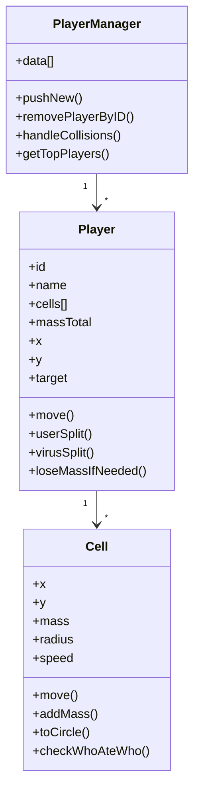

# Player And Cell Model

这份文档关注 `Player` / `Cell` 的数据结构与行为。

## 关键文件

- `apps/server/src/map/player.js`

这里是整个项目最核心的模型文件之一。

## 整体关系

可以把它理解成两层：

- `Player`：一个玩家对象
- `Cell`：玩家拥有的一个或多个细胞

一个玩家在未分裂时通常只有一个 `Cell`，分裂后就会有多个。

## `Cell`：最小可运动/可碰撞单位

### 主要字段

- `x`
- `y`
- `mass`
- `radius`
- `speed`

### 它负责什么

- 根据质量计算半径
- 朝目标方向移动
- 变更质量
- 转成 SAT 圆形
- 判断两个细胞是谁吃了谁

### 关键方法

#### `setMass(mass)`

更新质量并重算半径。

#### `addMass(mass)`

在现有质量基础上增减。

#### `toCircle()`

把自己变成 `sat.Circle`，供碰撞判断使用。

#### `move(...)`

这是 `Cell` 最重要的方法之一。

它会：

- 根据玩家中心点和目标点算方向
- 根据质量决定减速程度
- 当处于高速状态时逐步减速
- 距离目标太近时减小位移
- 更新自身坐标

从这里可以看到：

- 玩家移动不是直接改 `Player.x/y`
- 而是每个 `Cell` 先动，再反推出玩家中心点

#### `checkWhoAteWho(cellA, cellB)`

返回值语义：

- `0`：没人吃掉谁
- `1`：A 吃 B
- `2`：B 吃 A

底层使用 SAT 圆碰撞和“圆包含关系”来判断。

## `Player`：游戏里的参与者

### 主要字段

- `id`
- `name`
- `hue`
- `cells`
- `massTotal`
- `x`
- `y`
- `target`
- `screenWidth`
- `screenHeight`
- `lastHeartbeat`
- `timeToMerge`

此外这个分支还给玩家挂了很多扩展系统字段：

- `materialization`
- `connectionStatus`
- `intimacy / spike / pollution`
- `bodyParts / bodyPartCounts`
- `playerCardPreviewDataUrl`

所以这里的 `Player` 已经不是“纯吞噬游戏玩家”，而是一个被多个子系统增强过的综合对象。

## `Player` 的生命周期

### 1. 构造阶段

`new Player(id)` 时会：

- 设置 id
- 随机 hue
- 记录最后心跳
- 初始化 materialization
- 初始化 connection
- 初始化 relationship
- 初始化 body

### 2. 出生/重生阶段

`init(position, defaultPlayerMass)` 会：

- 创建初始 `cells`
- 设置 `massTotal`
- 设置中心点 `x/y`
- 把 `target` 归零
- 重新初始化扩展系统状态

### 3. 接收客户端数据

`clientProvidedData(playerData)` 会写入：

- 名字
- 屏幕尺寸
- 名片预览图

这一步只接客户端允许提供的数据，不把世界真实状态交给客户端决定。

## `Player` 的核心行为

### 1. `move(...)`

如果玩家只有一个 cell：

- 直接让这个 cell 向目标移动

如果玩家有多个 cell：

- 未到合并时间：先把重叠 cell 推开
- 到了合并时间：允许碰撞合并

之后：

- 对每个 cell 执行 `cell.move(...)`
- 再用所有 cell 的位置平均值更新玩家中心点

### 2. `loseMassIfNeeded(...)`

用于质量衰减。

只有在满足条件时才掉质量：

- 该 cell 质量足够大
- 玩家总质量超过阈值

### 3. `splitCell(...)`

把一个 cell 拆成多个质量相同的小 cell。

这里会限制：

- 拆分后不能小于默认质量

### 4. `virusSplit(...)`

当玩家吃到 virus 时调用。

特点：

- 倾向于把玩家拆到更多 cell

### 5. `userSplit(...)`

玩家主动按分裂键时调用。

特点：

- 尝试把每个 cell 对半分
- 如果 cell 太多，就优先拆最大的

### 6. `mergeCollidingCells()` / `pushAwayCollidingCells()`

多 cell 状态的关键行为：

- 合并期到了：重叠 cell 合并
- 还不能合并：重叠 cell 互相推开

## `PlayerManager`：玩家集合管理器

同一个文件里还有 `PlayerManager`。

它负责：

- 存储所有玩家 `data`
- 新增/删除玩家
- 缩减质量
- 访问指定 cell
- 处理玩家间碰撞
- 计算排行榜
- 统计总质量

### 值得注意的方法

#### `handleCollisions(callback)`

会遍历玩家两两组合，并对双方 cell 做碰撞检查。

#### `getTopPlayers()`

按 `massTotal` 排序并取前 10 名。

这里有一个值得留意的实现细节：

- 它直接对 `this.data` 做了原地排序

这意味着“排行榜计算”和“玩家数组顺序”是耦合的，后面如果出现依赖数组稳定顺序的逻辑，需要重点检查。

## 模型关系图

## 我对这套模型的理解

- 真正参与物理与吞噬的是 `Cell`，不是 `Player`。
- `Player` 更像一个“容器 + 汇总状态 + 扩展玩法挂载点”。
- 多数玩法复杂度都出在“一个玩家拥有多个 cell”这一层。
- 这套模型很适合继续扩展，但也容易让 `Player` 逐渐变胖。

## 读这份文件时最该抓的点

1. `Cell.move()`
2. `Player.move()`
3. `splitCell() / userSplit() / virusSplit()`
4. `mergeCollidingCells() / pushAwayCollidingCells()`
5. `PlayerManager.handleCollisions()`
