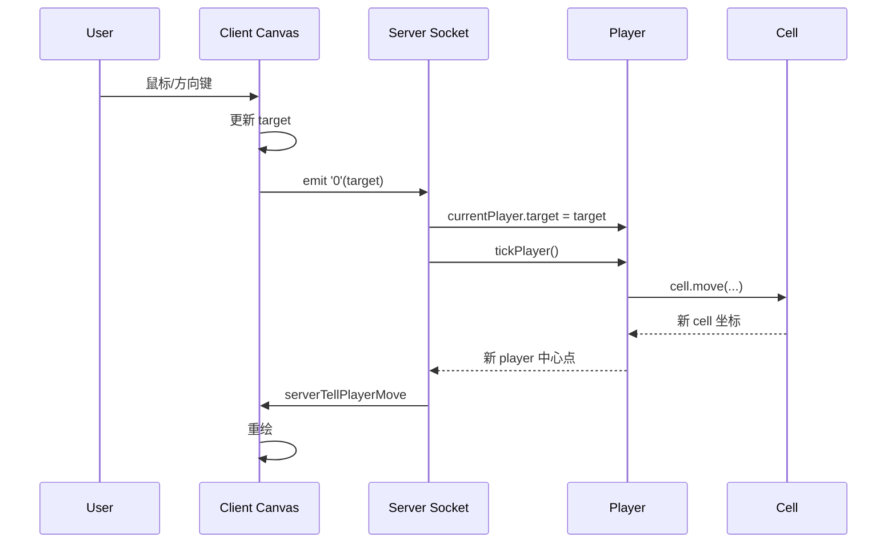

# Input To Movement

这份文档把“玩家怎么动起来”拆到最细。

目标是回答这几个问题：

- 鼠标/键盘输入最先落在哪
- 客户端把什么发给服务端
- 服务端什么时候真正移动玩家
- `Player` 和 `Cell` 在运动里各自负责什么

## 一句话概括

这个项目的运动链路是：

```text
浏览器输入
-> 更新客户端 target
-> socket.emit('0', target)
-> 服务端保存 currentPlayer.target
-> tickGame() 调用 currentPlayer.move()
-> 每个 cell 调用 cell.move()
-> 服务端把新位置通过 serverTellPlayerMove 发回客户端
-> 客户端按新位置重绘
```

## 关键文件

- `apps/client/src/canvas.js`
- `apps/client/src/app.js`
- `apps/client/src/global.js`
- `apps/server/src/server.js`
- `apps/server/src/map/player.js`
- `apps/server/src/lib/util.js`
- `apps/server/src/game-logic.js`

## 1. 客户端的“运动目标”是什么

客户端不会直接发“我要去世界坐标 x=123 y=456”。

它发的是一个相对目标：

- `target.x`
- `target.y`

这个值表示：

- 相对屏幕中心，我的输入方向在哪

例如鼠标在屏幕右侧，`target.x` 会是正数。

## 2. 输入从哪里进入

在 `apps/client/src/canvas.js` 里，`Canvas` 构造函数给画布绑定了这些事件：

- `mousemove`
- `mouseout`
- `keypress`
- `keyup`
- `keydown`
- `touchstart`
- `touchmove`

所以画布本身就是输入主入口。

## 3. 鼠标如何更新 target

`gameInput(mouse)` 做的是：

```text
target.x = mouse.clientX - canvas.width / 2
target.y = mouse.clientY - canvas.height / 2
```

也就是：

- 以屏幕中心作为原点
- 鼠标离中心越远，目标向量越大

这和很多双摇杆/鼠标指向类实时游戏的做法一致。

## 4. 键盘方向键如何更新 target

方向键不是直接给一个小步长，而是调用：

- `newDirection(...)`
- `updateTarget(...)`

`updateTarget(...)` 会把方向映射成极大的值：

- 左：`-Number.MAX_VALUE`
- 右：`+Number.MAX_VALUE`
- 上：`-Number.MAX_VALUE`
- 下：`+Number.MAX_VALUE`

这相当于告诉服务端：

- 我想一直朝这个方向极限移动

所以键盘和鼠标虽然表现不同，但最后都统一成一个 `target` 向量。

## 5. 哪些操作会发给服务端

客户端通过 socket 发这些核心事件：

- `'0'`：移动目标/心跳
- `'1'`：喷射质量
- `'2'`：主动分裂
- `'3'`：连接动作

其中和移动最直接相关的是 `'0'`。

## 6. `'0'` 什么时候发送

有三条主要路径。

### 1. 键盘方向变化时

在 `directionDown()` / `directionUp()` 里：

- 一旦方向发生变化，就 `socket.emit('0', target)`

### 2. 游戏每帧渲染时

在 `app.js` 的 `gameLoop()` 最后：

- `socket.emit('0', window.canvas.target)`

这相当于持续心跳。

### 3. 其他输入状态变化时

比如触摸和鼠标更新后，后续帧也会继续发送最新 target。

## 7. 服务端收到 `'0'` 后做什么

在 `apps/server/src/server.js`：

```js
socket.on('0', (target) => {
    currentPlayer.lastHeartbeat = new Date().getTime();
    if (target.x !== currentPlayer.x || target.y !== currentPlayer.y) {
        currentPlayer.target = target;
    }
});
```

这里做了两件事：

- 更新心跳时间，防止超时踢出
- 把客户端的目标意图保存到 `currentPlayer.target`

注意：

- 服务端此时还没有立刻移动玩家
- 它只是记下“下一次 tick 时该往哪走”

## 8. 真正的移动发生在什么时候

真正移动发生在服务端主循环：

- `tickGame()`

它每秒约 60 次执行：

```js
setInterval(tickGame, 1000 / 60);
```

而 `tickGame()` 会对每个玩家调用：

- `tickPlayer(currentPlayer)`

`tickPlayer()` 里再调用：

- `currentPlayer.move(...)`

## 9. `Player.move()` 在做什么

`Player.move()` 是“玩家层”的运动协调器。

它做的不是直接算最终位置，而是：

### 1. 处理多 cell 状态

如果玩家有多个 cell：

- 没到合并时间：把重叠 cell 推开
- 到了合并时间：允许它们重新合并

### 2. 让每个 cell 分别运动

对每个 `cell` 调用：

- `cell.move(this.x, this.y, this.target, slowBase, initMassLog, movementSpeedMultiplier)`

### 3. 边界修正

每个 cell 动完以后会调用：

- `adjustForBoundaries(...)`

防止跑出地图边界。

### 4. 回算玩家中心点

所有 cell 都动完后：

- 把每个 cell 的 `x/y` 求平均
- 更新 `Player.x / Player.y`

所以：

- `Player` 是中心点
- `Cell` 才是真正被移动的物理实体

## 10. `Cell.move()` 在做什么

这是运动算法真正落地的地方。

### 第一步：把 target 转成方向向量

它会先算：

```text
target.x = playerX - cell.x + playerTarget.x
target.y = playerY - cell.y + playerTarget.y
```

这里很关键。

因为：

- `playerX/playerY` 是玩家中心
- `cell.x/cell.y` 是这个 cell 自己的位置
- `playerTarget` 是客户端输入方向

这让每个 cell 都能以“玩家整体目标”为参考运动。

### 第二步：算距离和方向角

它会算：

- `dist = hypot(...)`
- `deg = atan2(...)`

接着用三角函数把速度拆到 x/y。

### 第三步：按质量减速

如果 cell 已经比较慢，会进入 `slowDown` 逻辑：

- `slowDown = log(mass, slowBase) - initMassLog + 1`

这意味着：

- 质量越大
- `slowDown` 越大
- 同样速度参数下，实际位移越小

这就是“越胖越慢”的核心实现。

### 第四步：高速状态衰减

如果 cell 当前速度大于最小速度：

- 每帧减掉 `SPEED_DECREMENT`

这主要服务于：

- 分裂后的高速冲刺

### 第五步：接近目标时减速

如果离目标太近：

- 位移会按距离比例缩小

这样不会在目标附近疯狂抖动或直接越过。

### 第六步：更新坐标

最后才把：

- `deltaX`
- `deltaY`

加到 cell 坐标上。

## 11. 地图边界如何限制运动

动完以后，服务端会调用：

- `adjustForBoundaries(position, radius, borderOffset, gameWidth, gameHeight)`

它会把位置夹在合法范围内：

- 不能小于左/上边界
- 不能大于右/下边界

所以真正的最终位置一定是地图内合法位置。

## 12. 客户端怎么看到新位置

服务端在后续的 `sendUpdates()` 里把新状态发出来：

- `serverTellPlayerMove`

客户端收到后：

- 更新 `player.x / y`
- 更新 `player.cells`
- 更新 `users`

然后下一帧 `gameLoop()` 重绘。

所以客户端看到的移动，本质上是：

- 服务端计算结果的可视化

## 13. 运动链路图



## 14. 这个实现最值得记住的点

- 客户端发的是“意图”，不是“结果”。
- 服务端把移动放进固定 tick 里统一计算。
- 真正动的是 `Cell`，不是 `Player`。
- `Player` 更像 cell 集合的中心点和状态容器。
- “越大越慢”是 `Cell.move()` 里的对数减速机制。
- 分裂后的冲刺来自 cell 自身速度更高，然后逐步衰减。

## 15. 我下一步想继续拆什么

沿着这条链，最自然的下一步有两种：

1. “分裂与喷射质量”链路
2. “吞噬碰撞”链路

如果目标是吃透玩法核心，我更建议下一个先拆“吞噬碰撞”。
