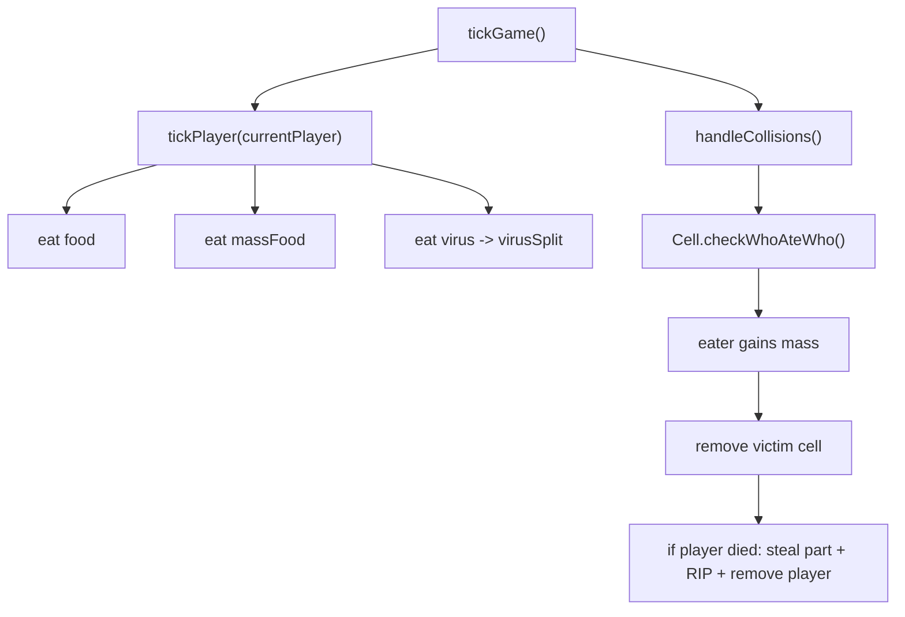

# Devour And Collision

这份文档专门解释“谁能吃谁”。

这是 Agar.io 类项目里最核心的玩法判断之一，因为玩家成长、死亡、分裂和节奏感都围绕它展开。

## 一句话概括

这个仓库把“吞噬”拆成两层：

- 玩家吃世界实体：食物、喷射质量、病毒
- 玩家之间互吃：cell 对 cell 的包含判定

## 关键文件

- `apps/server/src/server.js`
- `apps/server/src/map/player.js`
- `apps/server/src/map/food.js`
- `apps/server/src/map/massFood.js`
- `apps/server/src/map/virus.js`
- `apps/server/src/body.js`

## 1. 吞噬逻辑在哪个循环里

核心入口是：

- `tickGame()`

它每秒执行约 60 次。

其中与吞噬最直接相关的是：

- `tickPlayer(currentPlayer)`
- `map.players.handleCollisions(...)`

前者处理“玩家吃世界实体”，后者处理“玩家吃玩家”。

## 2. 玩家吃食物

在 `tickPlayer()` 里，对玩家的每个 cell：

- 先构造一个 SAT 圆形 `cellCircle`
- 然后找出哪些 food 落在这个圆里

判断方式很直接：

- `SAT.pointInCircle(...)`

只要 food 点在 cell 圆内，就算被吃掉。

吃掉以后：

- 从 `map.food` 删除这些 food
- 按 `foodMass` 增加玩家质量

所以 food 本质上是最简单的可吞噬资源。

## 3. 玩家吃喷射质量块

喷射质量块是 `massFood`。

它和普通 food 的区别在于：

- 它有速度
- 它有来源玩家 id
- 它有来源 cell 编号

判断逻辑在 `canEatMass(...)`：

- 质量块要落在 cell 圆内
- 不能是“自己刚喷出的、还在飞的、来自同一个 cell 的质量块”
- 当前 cell 质量必须大于质量块质量的 `1.1` 倍

这个限制很重要，因为它避免了：

- 玩家刚喷出来立刻自己吃回去

被吃掉后：

- 从 `map.massFood` 删除
- 把质量加到当前 cell

## 4. 玩家吃病毒

判断逻辑在 `canEatVirus(...)`：

- `virus.mass < cell.mass`
- virus 落在 cell 圆内

只要满足，就认为 cell 吃到了 virus。

但病毒不是普通加质量资源，它会触发：

- `cellsToSplit.push(cellIndex)`

然后在当前玩家的所有 cell 都检查完以后调用：

- `currentPlayer.virusSplit(...)`

所以病毒的关键效果不是简单加体积，而是：

- 诱发分裂

## 5. 玩家之间互吃

这部分不在 `tickPlayer()`，而在 `tickGame()` 后半段：

- `map.players.handleCollisions(callback)`

调用链是：

```text
tickGame()
-> PlayerManager.handleCollisions()
-> Player.checkForCollisions()
-> Cell.checkWhoAteWho()
```

## 6. `Cell.checkWhoAteWho()` 的规则

底层用的是 SAT 圆碰撞。

逻辑是：

1. 先检查两个圆是否碰撞
2. 如果 `bInA`，说明 B 完全被 A 包住，A 吃 B
3. 如果 `aInB`，说明 A 完全被 B 包住，B 吃 A

返回值语义：

- `0`：没人吃掉谁
- `1`：A 吃 B
- `2`：B 吃 A

所以这里不是“边缘碰一下就吃掉”，而是：

- 一个圆要真正包含另一个圆

## 7. 玩家被吃后会发生什么

在 `tickGame()` 的碰撞回调里：

### 第一步：计算吃人收益

先拿到被吃 cell 的质量：

- `cellGotEaten.mass`

再调用：

- `body.getPlayerDevourMassGain(cellGotEaten.mass, eaterPlayer)`

这一点说明这个分支已经不只是经典 Agar.io：

- 吃人的质量收益会受 `body` 系统影响

如果吃人者有额外的 `MOUTH`，收益会更高。

### 第二步：给吃人者加质量

调用：

- `eaterPlayer.changeCellMass(eater.cellIndex, massGain)`

### 第三步：移除被吃 cell

调用：

- `map.players.removeCell(gotEaten.playerIndex, gotEaten.cellIndex)`

如果移除后该玩家已经没有 cell 了：

- 这个玩家正式死亡

### 第四步：处理死亡附加效果

玩家死亡时还会：

- `body.stealRandomCorePart(loser, eater)`
- `io.emit('playerDied', { name: playerGotEaten.name })`
- 给本人发 `RIP`
- 把玩家从地图中删除

这说明这个项目的“死亡”不仅是退场，还会带来：

- 身体部件掠夺

## 8. 为什么有的吞噬在 `tickPlayer()`，有的在 `tickGame()`

因为这两类吞噬的性质不同：

### `tickPlayer()` 里的吞噬

对象是：

- food
- massFood
- virus

特点：

- 与单个玩家自己的 cell 运动强相关
- 不需要和别的玩家做两两遍历

### `tickGame()` 里的吞噬

对象是：

- 玩家与玩家之间

特点：

- 需要做玩家对玩家、cell 对 cell 的碰撞判断
- 更像全局交互

这种拆分让逻辑比较清楚。

## 9. 吃掉后质量怎么变化

### Food

- 增加固定 `foodMass`

### MassFood

- 增加被吃质量块自身 `mass`

### Player cell

- 增加 `body.getPlayerDevourMassGain(...)`

### Virus

- 触发分裂，不是直接普通增益

## 10. 与经典 Agar.io 的差异

这个分支在吞噬判定上和经典思路一致，但扩展了收益后果：

- 额外嘴巴会提高吞噬收益
- 玩家死亡会偷取核心部位
- 病毒仍然是分裂触发器
- 连接/关系/身体系统把“吃人结果”变得更像成长系统

## 11. 吞噬链路图



## 12. 当前实现里值得继续验证的点

### 1. `playerDied` 事件字段名有一处不一致

服务端发的是：

- `{ name: playerGotEaten.name }`

但客户端读取的是：

- `data.playerEatenName`

这会影响死亡提示文本是否正确显示。

### 2. `VirusManager.delete()` 更像只支持单个索引

当前 `tickPlayer()` 传入的是索引数组：

- `map.viruses.delete(eatenVirusIndexes)`

而 `VirusManager.delete()` 内部用的是：

- `splice(virusCollision, 1)`

这在“单个病毒”场景通常还能工作，但如果一个 cell 在同一 tick 命中多个 virus，行为需要额外验证。

## 13. 推荐配合阅读

1. `docs/03-server-game-loop.md`
2. `docs/04-player-and-cell-model.md`
3. `docs/06-input-to-movement.md`
