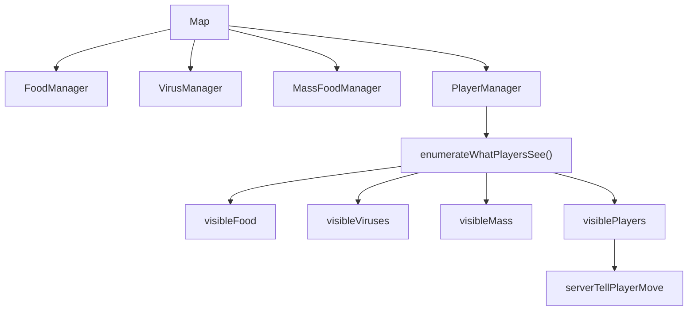

# World Entities And Visibility

这份文档解释世界里到底有哪些实体，以及服务端怎么决定“某个玩家能看到什么”。

## 一句话概括

服务端维护的是一个完整世界，但不会把完整世界发给每个玩家。

它会：

- 在服务端保存全量实体
- 按玩家视口和加成裁剪可见对象
- 只把每个玩家附近那一部分世界发回去

## 关键文件

- `apps/server/src/map/map.js`
- `apps/server/src/map/food.js`
- `apps/server/src/map/massFood.js`
- `apps/server/src/map/virus.js`
- `apps/server/src/lib/entityUtils.js`
- `apps/server/src/lib/util.js`

## 1. 世界里有哪些实体

在 `Map` 构造函数里，世界由 4 大实体集合组成：

- `food`
- `viruses`
- `massFood`
- `players`

可以把它理解成：

- `food`：地图基础资源
- `viruses`：特殊危险/分裂触发物
- `massFood`：玩家喷出的质量块
- `players`：玩家对象及其 cells

## 2. `Map` 的职责

`apps/server/src/map/map.js` 里的 `Map` 主要负责两件大事：

- 维持世界实体集合
- 为网络同步准备“每个玩家能看到的数据”

也就是说，它本身不是物理引擎，但它是世界状态的总容器。

## 3. 食物是怎么生成的

`FoodManager.addNew(number)` 会：

- 根据 `foodMass` 算半径
- 为每个新 food 找位置
- 推入 `this.data`

位置选择通过：

- `getPosition(this.foodUniformDisposition, radius, this.data)`

也就是：

- 如果配置要求均匀分布，就尽量远离已有实体
- 否则随机生成

## 4. 病毒是怎么生成的

`VirusManager.addNew(number)` 会：

- 从配置的质量范围里随机选质量
- 根据质量算半径
- 选位置
- 创建 virus

病毒有额外视觉属性：

- `fill`
- `stroke`
- `strokeWidth`

所以它既是玩法实体，也是有固定美术风格的对象。

## 5. 喷射质量块是怎么生成的

`MassFoodManager.addNew(playerFiring, cellIndex, mass)` 会创建一个 `MassFood`。

它会记录：

- 来源玩家 id
- 来源 cell 编号
- 质量
- 颜色 hue
- 初始位置
- 初始方向
- 初始速度

方向来自玩家当前输入方向：

- `playerFiring.target`

所以质量块飞出去的方向和玩家当前操作直接绑定。

## 6. 为什么世界总质量不会乱掉

关键在 `Map.balanceMass(...)`。

它会：

1. 统计当前 food 质量 + 玩家总质量
2. 和目标总质量 `gameMass` 做比较
3. 缺了就补 food
4. 多了就删掉部分 food
5. 同时保证 virus 数量补到 `maxVirus`

这意味着世界资源密度是被服务端主动控制的。

所以这不是“自然演化出来的世界”，而是：

- 一个被配置值持续拉回目标平衡点的世界

## 7. 实体位置如何生成

在 `entityUtils.js` 里：

- `getPosition(isUniform, radius, uniformPositions)`

内部调用两种策略：

- `util.randomPosition(radius)`
- `util.uniformPosition(points, radius)`

### `randomPosition`

在地图范围内随机找一个合法点。

### `uniformPosition`

尝试生成多个候选点，并挑一个和已有点距离更远的位置。

它不是严格最优解，更像：

- “粗略找一个不那么拥挤的位置”

## 8. 视野裁剪怎么做

关键函数是：

- `isVisibleEntity(entity, player, addThreshold = true)`

它的判断不是圆视野，而是矩形视野：

- 以玩家中心 `player.x / player.y` 为中心
- 用半个屏幕宽高作为视野边界

底层调用的是：

- `util.testRectangleRectangle(...)`

也就是说：

- 如果实体和玩家视口矩形相交，就认为可见

## 9. 身体系统如何影响视野

`isVisibleEntity()` 里有一段额外加成：

- `visionRangeBonus = player.bodyBonuses ? player.bodyBonuses.visionRangeBonus : 0`

这个 bonus 来自 `body` 系统里的额外 `HEAD`。

所以：

- 头越多
- 视野越大

这说明“身体部件”不是只影响显示，而是直接影响网络同步范围。

## 10. `enumerateWhatPlayersSee()` 在做什么

这是世界到网络同步之间最关键的桥梁。

它会对每个玩家：

### 1. 过滤可见 food

- `visibleFood`

### 2. 过滤可见 viruses

- `visibleViruses`

### 3. 过滤可见 massFood

- `visibleMass`

### 4. 过滤可见 players

对于其他玩家，不是看玩家中心点，而是：

- 只要该玩家任意一个 cell 可见，就把整个玩家数据放进去

### 5. 组装同步数据

`extractData(player)` 会提取：

- 基础位置
- cells
- massTotal
- hue
- id/name
- materialization
- connection
- relationship
- body
- `playerCardPreviewDataUrl`

所以玩家同步包已经不只是经典游戏状态，而是一个综合资料包。

## 11. 为什么观战和普通玩家看到的不一样

普通玩家走：

- `map.enumerateWhatPlayersSee(...)`

观战者走：

- `updateSpectator(socketID)`

而旁观者直接收到：

- 全部玩家
- 全部 food
- 全部 massFood
- 全部 virus

所以：

- 玩家视野是局部裁剪
- 观战视野是全图

## 12. 世界实体与可见性的关系图

## 13. 这个实现的特点

- 视野过滤发生在服务端，不在客户端。
- 过滤规则简单直接，比较容易读懂。
- 玩家同步包里包含了扩展玩法字段，说明“视野系统”和“角色成长系统”已经耦合。
- 观战模式直接拿全图状态，所以实现成本很低。

## 14. 值得继续观察的点

### 1. `uniformPosition()` 是近似策略

它更像快速启发式，而不是严格最均匀分布。

如果后面看到出生点或资源点分布不理想，这里值得回头看。

### 2. 同步粒度是“对象数组”

当前不是事件增量同步，而是：

- 每次直接发当前可见对象列表

这样简单，但在实体很多时网络成本会明显上升。

## 15. 推荐配合阅读

1. `docs/03-server-game-loop.md`
2. `docs/07-devour-and-collision.md`
