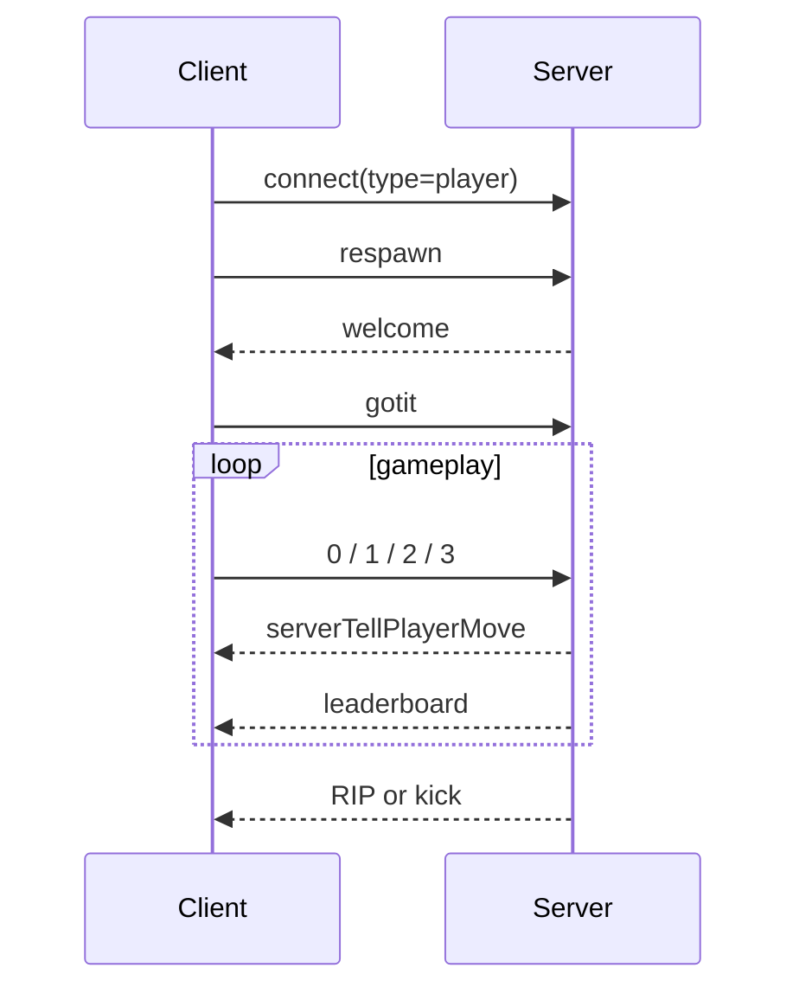

# Socket And Sync Protocol

这份文档把前后端通过 `socket.io` 交换的事件整理成一份“协议表”。

它不是正式的接口文档，但足够帮助我们快速回答：

- 客户端会发什么
- 服务端会回什么
- 哪些事件决定了游戏主流程

## 一句话概括

协议分四类：

- 进入游戏握手
- 高频输入与状态同步
- 聊天/管理命令
- 生命周期事件

## 关键文件

- `apps/client/src/app.js`
- `apps/client/src/canvas.js`
- `apps/client/src/chat-client.js`
- `apps/server/src/server.js`

## 1. 玩家握手流程

普通玩家的握手链路是：

```text
client connect(type=player)
-> client emit respawn
-> server emit welcome
-> client emit gotit
-> server add player to map
```

观战者则简单很多：

```text
client connect(type=spectator)
-> server emit welcome
-> client emit gotit
-> server add spectator
```

## 2. 客户端 -> 服务端事件

### `respawn`

作用：

- 请求初始化或重新进入游戏

服务端处理：

- 移除旧玩家记录
- 回发 `welcome`

### `gotit`

作用：

- 客户端确认收到 `welcome`
- 并提交自己的基础玩家资料

普通玩家携带：

- 名字
- 屏幕尺寸
- target
- 名片预览图

观战者基本不带有效玩家数据。

### `0`

作用：

- 发送移动目标
- 同时承担心跳

数据：

- `target`

这是当前最关键的高频输入事件。

### `1`

作用：

- 喷射质量

### `2`

作用：

- 主动分裂

### `3`

作用：

- 发起连接动作

这是这个分支新增玩法的一部分，不属于经典 Agar.io 标配输入。

### `windowResized`

作用：

- 更新服务端持有的玩家屏幕宽高

这会影响：

- 玩家视野范围

### `pingcheck`

作用：

- 手动测 ping

### `playerChat`

作用：

- 发送聊天消息

### `pass`

作用：

- 尝试管理员登录

### `kick`

作用：

- 管理员踢人

## 3. 服务端 -> 客户端事件

### `welcome`

作用：

- 返回玩家基础对象
- 返回地图尺寸

是进入游戏的握手起点。

### `pongcheck`

作用：

- 回应 ping 检测

### `serverTellPlayerMove`

作用：

- 同步当前可见世界状态

数据顺序：

1. `playerData`
2. `userData`
3. `foodsList`
4. `massList`
5. `virusList`

这是最核心的同步事件。

### `leaderboard`

作用：

- 同步排行榜
- 同步玩家总数

### `playerJoin`

作用：

- 广播有玩家加入

### `playerDisconnect`

作用：

- 广播有玩家离开

### `playerDied`

作用：

- 广播有玩家被吞掉

### `serverMSG`

作用：

- 发系统消息

常见场景：

- 管理员登录结果
- 权限不足
- 踢人反馈

### `serverSendPlayerChat`

作用：

- 广播玩家聊天内容

### `RIP`

作用：

- 告知当前客户端自己已经死亡

客户端收到后会：

- 停止游戏状态
- 显示死亡提示
- 延迟回到开始菜单

### `kick`

作用：

- 强制踢出当前客户端

## 4. 为什么有些事件名这么短

这个仓库把高频操作用了单字符数字事件：

- `'0'`
- `'1'`
- `'2'`
- `'3'`

好处：

- 短
- 早期写起来快

坏处：

- 可读性差
- 协议不自描述

如果以后要重构协议层，这里会是一个非常自然的改造点。

## 5. 同步频率

### 输入上报频率

`'0'` 会在：

- 每帧渲染时发送
- 方向键变化时发送

所以它很频繁。

### 世界状态下发频率

来自：

- `sendUpdates`

频率是：

- `1000 / config.networkUpdateFactor`

当前配置里 `networkUpdateFactor = 40`，也就是大约每秒 40 次。

### 世界模拟频率

来自：

- `tickGame`

频率是：

- 每秒约 60 次

所以这是一个典型的：

- 模拟频率高于网络同步频率

的实时游戏结构。

## 6. `serverTellPlayerMove` 为什么这么重要

因为它把客户端真正关心的全部世界快照一次性发出来了。

客户端拿到它以后会更新：

- 自己的位置和 cells
- 可见玩家数组
- 可见 food
- 可见病毒
- 可见质量块
- HUD 状态

所以这个事件几乎等于：

- “当前帧你看到的世界”

## 7. 协议流程图



## 8. 这个协议设计的特点

- 握手很轻量
- 高频状态主要集中在 `serverTellPlayerMove`
- 管理命令和聊天复用了同一 socket 通道
- 观战协议比玩家协议简单很多

## 9. 当前实现里值得注意的点

### 1. 协议字段顺序依赖很强

`serverTellPlayerMove` 不是对象包，而是多个位置参数。

这意味着：

- 前后端必须严格共享相同顺序约定

### 2. 单字符事件名不利于后期维护

现在还能靠上下文记住，但随着玩法增加，会越来越难读。

### 3. `playerDied` 事件字段需要核对

服务端发出的字段名和客户端读取的字段名当前并不完全一致，后面最好统一。

## 10. 推荐配合阅读

1. `docs/01-startup-flow.md`
2. `docs/02-client-render-loop.md`
3. `docs/06-input-to-movement.md`
