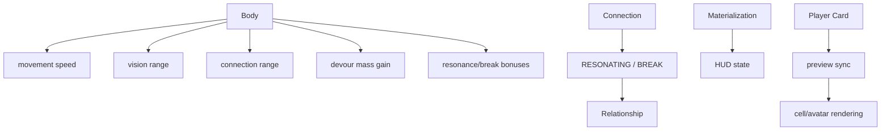

# Custom Systems

这份文档解释这个仓库相对经典 Agar.io 新增的那几套系统。

如果只看主循环，你会感觉它还是一个传统吞噬游戏。
但一旦把这些模块接起来看，就会发现它已经往“角色成长 + 社交状态 + 外观系统”走了不少。

## 一句话概括

这里最重要的 5 套扩展是：

- `materialization`
- `connection`
- `relationship`
- `body`
- `player card`

其中前 4 套主要在服务端定义状态与效果，`player card` 主要是客户端发起、服务端中转、客户端渲染。

## 关键文件

- `apps/server/src/materialization.js`
- `apps/server/src/connection.js`
- `apps/server/src/relationship.js`
- `apps/server/src/body.js`
- `configs/game/materialization.js`
- `configs/game/connection.js`
- `configs/game/relationship.js`
- `configs/game/body.js`
- `apps/client/src/materialization-status.js`
- `apps/client/src/connection-status.js`
- `apps/client/src/relationship-status.js`
- `apps/client/src/body-status.js`

## 1. Materialization

### 作用

`materialization` 像是一个“实体化程度”状态机。

它有 4 个阶段：

- `HOLLOW`
- `PARTIAL`
- `REAL`
- `OVERREAL`

### 配置来源

- `configs/game/materialization.js`

默认值：

- `defaultMaterialization: 0`

### 服务端做什么

`applyMaterializationState(target)` 会把这两个字段挂到玩家上：

- `materialization`
- `materializationStage`

### 客户端做什么

客户端不会自己计算阶段，而是直接显示服务端同步下来的：

- 数值
- 阶段名

### 当前观察

在目前这版代码里，它更多像：

- 已建立数据模型和 HUD 展示

但还没有深度介入主循环中的行为变化。

## 2. Connection

### 作用

这是这个分支最明显的新玩法之一。

玩家可以通过输入事件 `'3'` 发起“连接”。

连接状态有：

- `IDLE`
- `CHANNELING`
- `RESONATING`
- `BREAK`

### 配置来源

- `configs/game/connection.js`

包括：

- 尝试范围
- 蓄力时长
- 共鸣时长
- 断裂时长

### 服务端主流程

入口在 `server.js` 的：

- `attemptConnection(currentPlayer)`

过程大致是：

1. 只有 `IDLE` 玩家能发起
2. 找附近最近的可连接目标
3. 双方先进入 `CHANNELING`
4. 延迟一段时间后判断结果
5. 距离够近则 `RESONATING`
6. 否则 `BREAK`
7. 再通过定时器清空状态

### 与 Body 的关系

连接距离不是固定死值，而是：

- `body.getConnectionRange(baseRange, currentPlayer)`

也就是：

- 多余的 `HAND` 会增加连接距离

## 3. Relationship

### 作用

`relationship` 是连接系统的结果统计层。

玩家身上挂了 3 个数值：

- `intimacy`
- `spike`
- `pollution`

### 配置来源

- `configs/game/relationship.js`

### 如何变化

在连接结果结算时调用：

- `relationship.applyConnectionOutcome(actor, target, outcome)`

如果结果是 `RESONATING`：

- 增加 `intimacy`

如果结果是 `BREAK`：

- 增加 `spike`
- 增加 `pollution`

### 与 Body 的关系

`HEART` 和 `SPIKE` 会进一步加成：

- 额外 `HEART` 提高共鸣时的 `intimacy`
- 额外 `SPIKE` 提高断裂时的 `spike`

所以：

- `relationship` 不是独立系统
- 它和 `body` 是联动的

## 4. Body

### 作用

`body` 是这个仓库里最像“角色成长天赋系统”的模块。

默认开局只带玩家签名生成的部位：

- `HAND`

身体完成需要凑齐核心部位集合：

- `HEAD`
- `HAND`
- `FOOT`
- `MOUTH`
- `HEART`

还有一个扩展部位：

- `SPIKE`

### 默认加载

来自：

- `configs/game/body.js`

### Body 实际会影响什么

不是纯显示，它会直接改玩法：

- 额外 `FOOT`：更快移动
- 额外 `HAND`：更远连接距离
- 额外 `HEAD`：更大视野
- 额外 `HEART`：更高共鸣亲密值
- 额外 `SPIKE`：更高断裂尖刺值
- 额外 `MOUTH`：更高吞噬玩家收益

这几乎把成长系统打进了：

- 移动
- 视野
- 交互范围
- 社交结算
- 吞噬收益

### 死亡时的掠夺

玩家被彻底吞掉时，会调用：

- `body.stealRandomCorePart(loser, eater)`

也就是吃人者会从失败者身上掠夺一个核心部位。

这让“吞噬”不再只是加质量，而是：

- 角色能力继承

## 5. Player Card

### 作用

这是偏客户端的外观与身份展示系统。

玩家在开始菜单里可以绘制自己的卡片。

服务端同步的不是整个编辑过程，而是：

- `playerCardPreviewDataUrl`

### 数据流

客户端在握手时把预览图 URL 带上：

- `player.playerCardPreviewDataUrl = global.playerCard ? ... : null`

服务端保存到玩家对象上。

之后 `Map.enumerateWhatPlayersSee()` 会把这个字段同步给其他可见玩家。

客户端渲染时，如果目标玩家有预览图：

- 会在 HUD 显示目标卡片
- 还可能把头像绘制到 cell 内部

### 特点

它不直接改变玩法，但会改变：

- 视觉识别
- 身份表达
- 目标 HUD 信息量

## 6. HUD 如何展示这些系统

在客户端 `renderStatusPanel()` 里，会把几套状态拼在排行榜下方：

- `formatMaterializationStatus(player)`
- `formatConnectionStatus(player)`
- `formatRelationshipStatus(player)`
- `formatBodyStatus(player)`

所以它们都已经进入主 HUD。

也就是说，这些系统不是隐藏设定，而是：

- 被当作玩家持续可见信息

## 7. 扩展系统关系图

## 8. 这个分支和经典版最大的差异

如果只保留经典玩法，代码主轴应该主要围绕：

- movement
- split
- eat
- render

但这个分支额外引入了：

- 社交式连接
- 关系数值
- 身体成长与掠夺
- 外观名片同步

所以它更像：

- “Agar.io 玩法底座 + 自定义成长/关系层”

## 9. 当前值得注意的地方

### 1. Materialization 现在更像铺垫系统

已经有配置、状态、测试、HUD，但还没深度进入核心规则变化。

### 2. Body 是扩展系统里最深的一层

因为它直接影响了：

- movement
- visibility
- connection
- devour
- death rewards

### 3. Connection / Relationship 是一套联动设计

前者定义行为过程，后者定义数值结果。

## 10. 推荐配合阅读

1. `docs/04-player-and-cell-model.md`
2. `docs/07-devour-and-collision.md`
3. `docs/08-world-entities-and-visibility.md`
